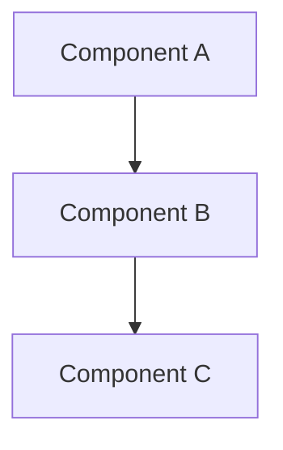
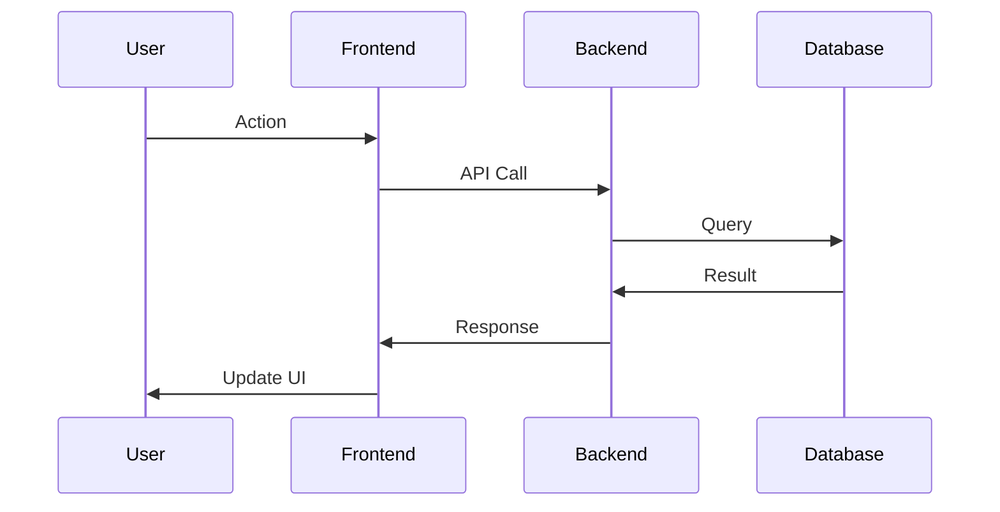

# Design: [Feature Name]

## Architecture Overview
_High-level description of how this feature fits into the system._

## System Diagram


## Components

### Component 1: [Name]
**Purpose**: _What does this component do?_  
**Technology**: _What tech stack?_  
**Interfaces**: _What APIs/contracts does it expose?_

### Component 2: [Name]
**Purpose**: _What does this component do?_  
**Technology**: _What tech stack?_  
**Interfaces**: _What APIs/contracts does it expose?_

## Data Model
_Schemas, database tables, data structures_

```typescript
interface Example {
  field1: string;
  field2: number;
}
```

## API Endpoints
_For backend features_

### `POST /api/endpoint`
- **Purpose**: _What does this endpoint do?_
- **Request**: _Request body schema_
- **Response**: _Response schema_
- **Auth**: _Authentication requirements_

## State Management
_For frontend features - how state is managed_

## Sequence Diagram


## Technical Decisions

### Decision 1: [Decision Name]
**Options Considered**: Option A, Option B  
**Chosen**: Option A  
**Rationale**: _Why this option?_

### Decision 2: [Decision Name]
**Options Considered**: Option A, Option B  
**Chosen**: Option B  
**Rationale**: _Why this option?_

## Security Considerations
- Security consideration 1
- Security consideration 2

## Performance Considerations
- Performance consideration 1
- Performance consideration 2

## Testing Strategy
- Unit tests: _What to test_
- Integration tests: _What to test_
- E2E tests: _What to test_

## Risks & Mitigations
| Risk | Impact | Mitigation |
|------|--------|------------|
| Risk 1 | High | Mitigation approach |
| Risk 2 | Medium | Mitigation approach |