# Copilot Memory Bank & Project Instructions

## Summary

This document defines how GitHub Copilot maintains project memory and context across sessions. Copilot’s memory resets between sessions, so all project knowledge must be captured in the Memory Bank to ensure continuity, accuracy, and effective collaboration.

---

## Core Principle

**Copilot MUST read ALL memory bank files at the start of EVERY task.**

* No exceptions.
* Use this checklist before any work:

  * [ ] Read `projectbrief.md`
  * [ ] Read `productContext.md`
  * [ ] Read `systemPatterns.md`
  * [ ] Read `techContext.md`
  * [ ] Read `activeContext.md`
  * [ ] Read `progress.md`
  * [ ] Read `copilot-rules.md`
  * [ ] Read any additional context files in `/memory-bank/`

---

## Memory Bank Structure

The Memory Bank consists of required core files and optional context files, all in Markdown. Files build upon each other in a clear hierarchy:


### Core Files (Required)

1. **projectbrief.md**
   Foundation document for all others. Defines core requirements, goals, and project scope.
2. **productContext.md**
   Why this project exists, problems it solves, user experience goals.
3. **systemPatterns.md**
   System architecture, key technical decisions, design patterns, component relationships.
4. **techContext.md**
   Technologies used, development setup, technical constraints, dependencies.
5. **activeContext.md**
   Current work focus, recent changes, next steps, active decisions.
6. **progress.md**
   What works, what’s left to build, current status, known issues.
7. **copilot-rules.md**
   Project rules, Copilot guidance, safety/security policies, evolving project patterns.

### Additional Context

Add extra files/folders in `/memory-bank/` for:

* Complex features
* Integration specs
* API docs
* Testing strategies
* Deployment procedures

---

## Feature Development Workflow

This workflow defines how features move from concept to production code. It ensures requirements are understood, design is validated, and implementation is structured before code is written.

### Overview: PRD → Design → Tasks → Code

```mermaid
flowchart LR
    PRD[📋 PRD] -->|Approve| Design[🎨 Design]
    Design -->|Approve| Tasks[✅ Tasks]
    Tasks -->|Implement| Code[💻 Code]
    Code -->|Review| Done[✨ Complete]
    
    PRD -.Update.-> MB[(Memory Bank)]
    Design -.Update.-> MB
    Tasks -.Update.-> MB
    Code -.Update.-> MB
```



### Phase 1: PRD (Product Requirements Document)

**Goal:** Define WHAT needs to be built and WHY.

**Activities:**
- Identify the problem to solve
- Define success criteria
- Specify user stories and acceptance criteria
- Document constraints and dependencies

**Deliverables:**
- `prd.md` in feature folder
- Update `activeContext.md` with feature scope

**Gate:** User approves PRD before moving to Design

### Phase 2: Design

**Goal:** Define HOW it will be built.

**Activities:**
- Architect the solution
- Choose technologies and patterns
- Design data models and APIs
- Create system diagrams (use Mermaid)
- Identify technical risks

**Deliverables:**
- `design.md` in feature folder
- Update `systemPatterns.md` if new patterns introduced
- Update `techContext.md` if new technologies used

**Gate:** User approves Design before moving to Tasks

### Phase 3: Tasks

**Goal:** Break down implementation into trackable units.

**Activities:**
- Create specific, testable tasks
- Define acceptance criteria per task
- Identify dependencies between tasks
- Estimate complexity

**Deliverables:**
- `tasks.md` in feature folder with task IDs
- Update `progress.md` with task list

**Gate:** User approves Tasks before coding begins

### Phase 4: Code & Test

**Goal:** Implement and validate each task.

**Activities:**
- Implement one task at a time
- Write tests alongside code
- Update documentation as you go
- Review and validate each task

**Deliverables:**
- Working code with tests
- Updated `progress.md` with completed tasks
- Updated `activeContext.md` with recent changes
- Updated `copilot-rules.md` with new patterns or learnings

**Gate:** All tasks completed and tests passing

### Memory Bank Integration


**Key Principle:** The memory bank is updated incrementally throughout the workflow, not just at the end.

---

## Core Workflows

### Plan Mode


**Description:**

* Always start by reading all memory bank files.
* If files are missing, create a plan and document it.
* If files are complete, verify context and develop a strategy before acting.

### Act Mode


**Description:**

* Check memory bank before any action.
* Update documentation as you work.
* Update `copilot-rules.md` if new patterns or rules are discovered.
* Document all changes.

---

## Documentation Updates

Update the Memory Bank when:

1. Discovering new project patterns or rules
2. After significant changes
3. When the user requests with **update memory bank** (review ALL files)
4. When context needs clarification


**Note:**
On **update memory bank**, review every file, even if some don’t require changes.
Focus on `activeContext.md` and `progress.md` for current state.

---

## Project Rules (`copilot-rules.md`)

This file is Copilot’s and the team’s learning journal for the project. It captures:

* Critical implementation paths
* User preferences and workflow
* Project-specific patterns
* Security requirements and known challenges
* Evolution of project decisions
* Tool usage patterns

**Example: Core Security Rule**

```markdown
## 🚨 Security: Never Upload Secrets

- Never copy, move, or commit secret files or values (e.g., `.env`, `secrets.json`, API keys, tokens, passwords) to version control or into example/sample config files.
- Example files like `.env.example` must be built by hand with only safe placeholder values.
- Always verify that no secrets are present before staging, committing, or pushing code.
- If a secret is ever committed, treat as a security incident: remove from history and rotate affected credentials immediately.
- Use secret scanning tools (e.g., GitHub Secret Scanning, TruffleHog, git-secrets) for extra safety.
```

---

## How to Use This Document

* Reference this file at the start of every session.
* Use the checklists and diagrams to guide your workflow.
* Update the Memory Bank and `copilot-rules.md` as you learn.
* Treat this as a living document—improve it as the project evolves.

---

**REMEMBER:**
After every memory reset, Copilot begins completely fresh. The Memory Bank is the only link to previous work. Maintain it with precision and clarity—project effectiveness and security depend on its accuracy.

---

*Last updated: 2025-06-30*
*Version: 1.1.0*
