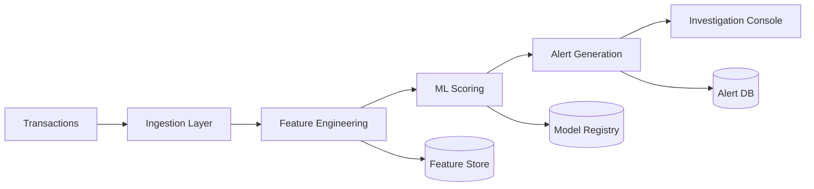
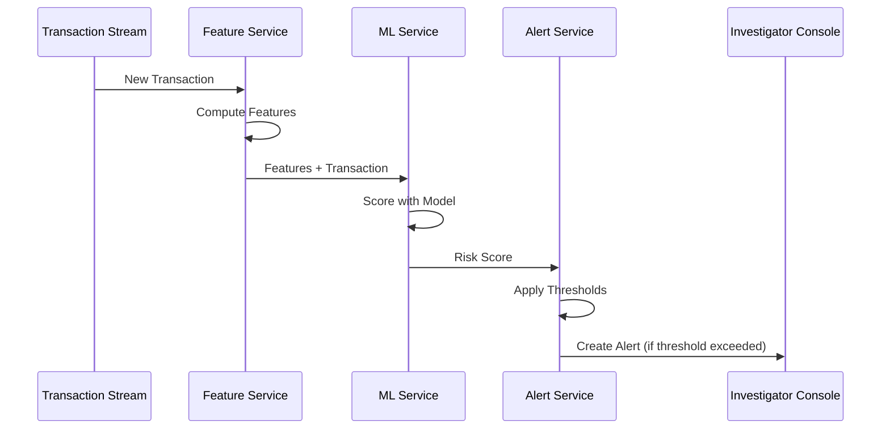
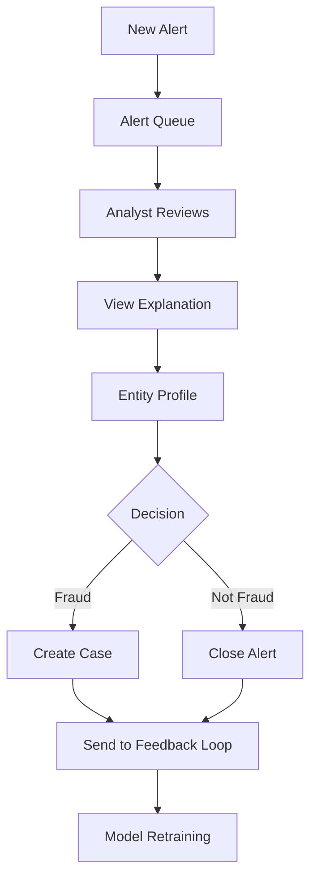

# System Patterns

## Architecture Overview

The system follows an event-driven microservices architecture with clear separation between:
- **Ingestion Layer**: Transaction streaming and batch processing
- **Feature Engineering Layer**: Real-time feature computation
- **ML Scoring Layer**: Model inference and alert generation  
- **Application Layer**: Investigation console and case management
- **Data Layer**: Time-series storage, feature store, model registry

## Key Design Patterns

### 1. Event-Driven Architecture
- All transaction flows emit events
- Loose coupling between components
- Enables real-time and batch processing modes
- Supports replay and reprocessing

### 2. Feature Store Pattern
- Centralized feature computation and storage
- Consistent features across training and inference
- Point-in-time correctness for historical features
- Low-latency feature serving for real-time scoring

### 3. Model Registry Pattern
- Versioned model artifacts with metadata
- A/B testing and canary deployment support
- Model lineage and experiment tracking
- Rollback capability

### 4. CQRS (Command Query Responsibility Segregation)
- **Write Path**: Transaction ingestion → Feature computation → Alert generation
- **Read Path**: Investigation console queries optimized read models
- Separate databases for writes vs. reads where appropriate

### 5. Audit Trail Pattern
- All actions logged with user, timestamp, and context
- Immutable event log for compliance
- Retention policies aligned with regulatory requirements

## Component Interaction Patterns

### Real-Time Transaction Scoring

### Investigation Workflow

## Data Patterns

### Time-Series Storage
- Transaction data stored in time-series optimized DB
- Partitioned by time (daily/weekly) for efficient queries
- TTL policies for data retention

### Materialized Views
- Pre-aggregated entity statistics (transaction counts, velocity, amounts)
- Updated incrementally as new transactions arrive
- Improves query performance for entity profiles

## Security Patterns

### Zero-Trust API Access
- All API calls require authentication
- Role-based access control (RBAC)
- Audit logging of all access

### Data Masking
- PII redacted in logs and non-production environments
- Entity IDs hashed or tokenized where appropriate
- Secure key management for encryption

## Scalability Patterns

### Horizontal Scaling
- Stateless services can scale horizontally
- Partitioned event streams for parallel processing
- Sharded databases for high-volume entities

### Caching
- Feature cache for frequently scored entities
- Model cache to avoid repeated model loading
- Alert queue cache for fast console loading