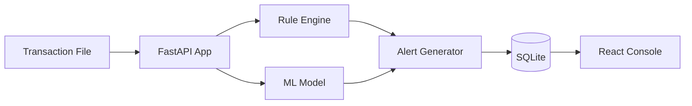
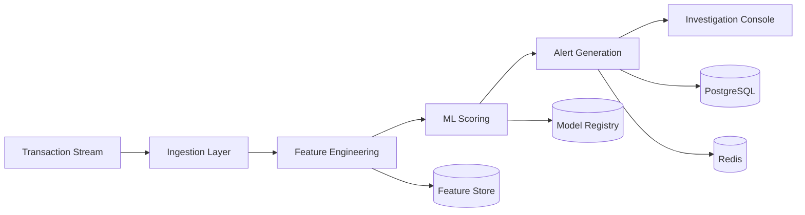
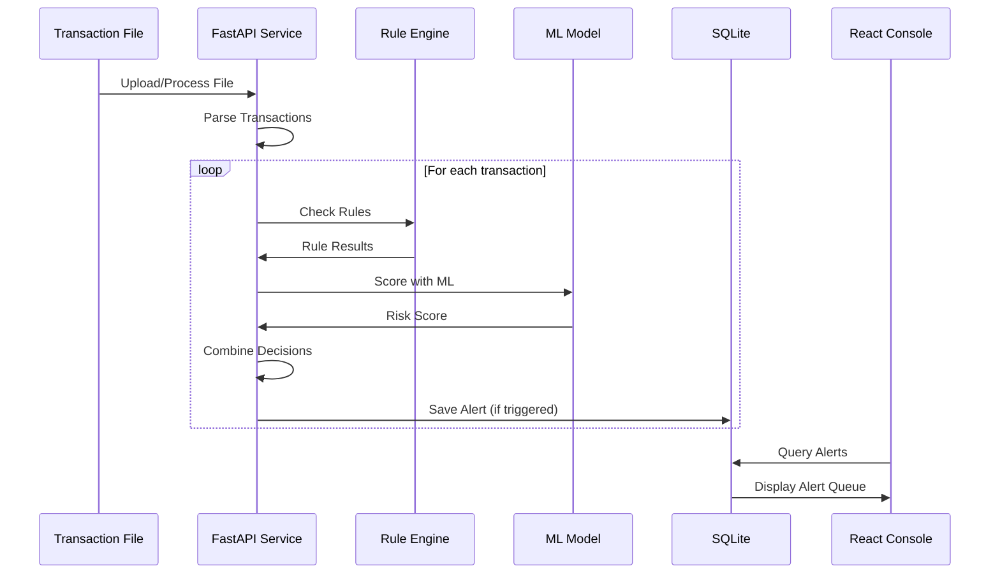

# System Patterns

## Architecture Overview

**The system architecture follows a phased approach:**

### Phase 1 (Local POC) - Simplified Monolithic Architecture
- **Monolithic FastAPI Application**: Single application for all logic
- **Batch Processing**: Process transactions from files (CSV/JSON)
- **SQLite Database**: Single file-based database for all data
- **Rule Engine + ML Model**: Combined scoring within application
- **React UI**: Basic investigator console with local state



### Phase 2+ (Production) - Microservices Architecture
- **Event-Driven Microservices**: Clear separation between components
- **Ingestion Layer**: Transaction streaming and batch processing
- **Feature Engineering Layer**: Real-time feature computation
- **ML Scoring Layer**: Model inference and alert generation  
- **Application Layer**: Investigation console and case management
- **Data Layer**: PostgreSQL, Redis, feature store, model registry



## Key Design Patterns

### Phase 1 (Local POC) - Simplified Patterns

#### 1. Monolithic Application Pattern
- Single FastAPI application handles all requests
- Direct function calls between components (no messaging)
- Simpler to develop, debug, and demo locally

#### 2. File-Based Storage (SQLite)
- Single database file for all data
- Alembic for schema migrations
- Suitable for demo and development, not production

#### 3. Batch Processing Pattern
- Process transactions from CSV/JSON files
- Load → Score → Generate Alerts → Store
- No real-time streaming requirement

#### 4. Combined Scoring Pattern
- Rule engine and ML model in same process
- Rules checked first (fast), then ML scoring if needed
- Combined decision logic produces single alert with both rule and ML reasons

### Phase 2+ (Production) - Advanced Patterns

#### 1. Event-Driven Architecture
- All transaction flows emit events
- Loose coupling between components
- Enables real-time and batch processing modes
- Supports replay and reprocessing

####Phase 1: Batch Transaction Scoring


### Phase 2+: Real-Time Transaction Scoring
```mermaid
sequenceDiagram
    participant T as Transaction Stream
    participant F as Feature Service
    participant M as ML Service
    participant R as Rule Engine
    participant A as Alert Service
    participant I as Investigator Console
    
    T->>F: New Transaction
    F->>F: Compute Features
    F->>M: Features + Transaction
    M->>M: Score with Model
    M->>R: Transaction + ML Score
    R->>R: Check Rules
    R->>A: Combined Resultsnsaction ingestion → Feature computation → Alert generation
- **Read Path**: Investigation console queries optimized read models
- Separate databases for writes vs. reads where appropriate

#### 5. Audit Trail Pattern
- All actions logged with user, timestamp, and context
- Immutable event log for compliance
- Retention policies aligned with regulatory requirements

## Component Interaction Patterns

### Real-Time Transaction Scoring
```mermaid
sequenceDiagram
    participant T as Transaction Stream
    participant F as Feature Service
    participant M as ML Service
    participant A as Alert Service
    participant I as Investigator Console
    Phase 1 (SQLite)
- **Single Database File**: All data in one SQLite file
- **Simple Schema**: Transactions, Alerts, Cases, Entities
- **No Partitioning**: Small dataset, no optimization needed
- **Direct Queries**: ORM (SQLAlchemy) for all data access

### Phase 2+ (PostgreSQL + Redis)

#### Time-Series Storage
- Transaction data stored in TimescaleDB (PostgreSQL extension)
- Partitioned by time (daily/weekly) for efficient queries
- TTL policies for data retention
Phase 1 (Local POC)
- **No Authentication**: Local demo only, open access
- **Basic Validation**: Input validation for API endpoints
- **Simple Logging**: Debug logs for troubleshooting
- **No Secrets**: Minimal configuration, no sensitive data

### Phase 2+ (Production)

#### Zero-Trust API Access
- All API calls require authentication (JWT/OAuth)
- Role-based access control (RBAC)
- Audit logging of all access

#
#### Caching Layer (Redis)
- Feature cache for frequently scored entities
- Session management for authenticated users
- Alert queue cache for fast console loading

### Investigation Workflow
```mermaid
flowchart TD
    Alert[New Alert] --> Queue[Alert Queue]
    Queue --> Analyst[Analyst Reviews]
    Analyst --> Explain[View Explanation]
    Explain --> Entity[Entity Profile]
    Entity --> Decide{Decision}
    Decide -->|Fraud| Case[Create Case]
    Decide -->|Not Fraud| Close[Close Alert]
    Case --> Feedback[Send to Feedback Loop]
    Close --> Feedback
    Feedback --> Retrain[Model Retraining]
```

## Data Patterns

### Time-Series Storage
- Transaction data stored in time-series optimized DB
- Partitioned by time (daily/weekly) for efficient queries
- TTPhase 1 (Local POC)
- **Single Process**: No horizontal scaling needed
- **SQLite Limitations**: Single-writer, suitable for demo only
- **Batch Processing**: Process files sequentially
- **No Caching**: Direct database queries acceptable for demo

### Phase 2+ (Production)

#### Horizontal Scaling
- Stateless services can scale horizontally
- Partitioned event streams for parallel processing
- Sharded databases for high-volume entities

#### Caching
- Feature cache for frequently scored entities
- Model cache to avoid repeated model loading
- Alert queue cache for fast console loading

---

<!-- Generated by Copilot -->
<!-- Last updated: Added Phase 1 (POC) vs Phase 2+ (Production) architecture patterns -->
### Zero-Trust API Access
- All API calls require authentication
- Role-based access control (RBAC)
- Audit logging of all access

### Data Masking
- PII redacted in logs and non-production environments
- Entity IDs hashed or tokenized where appropriate
- Secure key management for encryption

## Scalability Patterns

### Horizontal Scaling
- Stateless services can scale horizontally
- Partitioned event streams for parallel processing
- Sharded databases for high-volume entities

### Caching
- Feature cache for frequently scored entities
- Model cache to avoid repeated model loading
- Alert queue cache for fast console loading